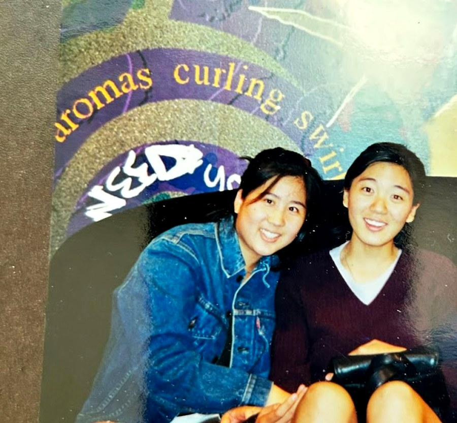

# Dead Dads Club

A collection of digital love letters to our fathers. By Jessica Lee and Emily Tsiang.

## File structure

```
.
├── index.html              ← homepage (wordmark, quote, object grid)
├── about.html              ← about page
├── submit.html             ← submit page
├── styles.css              ← all styling (one file, easy to edit)
├── images/
│   ├── wordmark.png        ← hand-drawn "Dead Dads Club"
│   ├── rice-cooker.png
│   ├── clock.png
│   ├── gold.png
│   ├── thermos.png
│   ├── orange-peels.png
│   ├── lion-instruments.png
│   └── about-placeholder.svg  ← replace with real "Emily + Jess 1999" photo
└── letters/
    ├── rice-cooker.html
    ├── clock.html
    ├── gold.html
    ├── thermos.html
    ├── orange-peels.html
    └── lion-instruments.html
```

## Deploying on GitHub Pages

1. Create a new repository on GitHub (e.g. `dead-dads-club`).
2. Upload all the files in this folder to the root of the repo.
3. In the repo's Settings → Pages: set source to `Deploy from a branch`, branch `main`, folder `/ (root)`.
4. Your site will be live at `https://<your-username>.github.io/dead-dads-club/` within a minute or two.

If you'd like a custom domain (e.g. `deaddadsclub.org`), buy the domain from any registrar, then in Settings → Pages → Custom domain, enter the domain. Add the DNS records GitHub shows you.

## Adding your real letters

Each letter lives in its own HTML file in the `letters/` folder. To add a real letter:

1. Open the file (e.g. `letters/rice-cooker.html`) in any text editor.
2. Find the `<article class="letter-body ...">` section.
3. Replace the three placeholder `<p>` paragraphs with your letter's paragraphs. Each paragraph should be wrapped in `<p>...</p>`. Remove the `class="letter-placeholder"` from the `<p>` tags so they get the regular letter styling (with the drop cap on the first paragraph).

Example:

```html
<article class="letter-body fade-in fade-in-4">
  <p>The first paragraph of the letter goes here. The first letter will automatically become a drop cap.</p>
  <p>More paragraphs continue here.</p>
  <p>And so on.</p>
  <p class="letter-signoff">— Emily</p>
</article>
```

## Replacing the about-page photo

Replace `images/about-placeholder.svg` with your scanned photo (any image format works — `.jpg`, `.png`, `.webp`). Then in `about.html`, change the line:

```html

```

to point to your file, for example:

```html

```

## Updating the email address

The submit page currently links to `hello@deaddadsclub.org`. Open `submit.html` and search for that string to change it to your real address.

## Editing styles

All visual styling lives in `styles.css`. CSS variables are at the top — colors, max widths, etc. can be tweaked there in one place.

## Adding more letters later

To add a 7th, 8th, etc. object:
1. Add the processed image to `images/` (transparent PNG works best).
2. Copy `letters/rice-cooker.html` to a new file like `letters/new-object.html` and update the title, image, number, and content.
3. Add a new `<a class="tile">` block to the grid in `index.html`.
4. Update the prev/next nav at the bottom of the surrounding letter pages so your new letter is in sequence.
